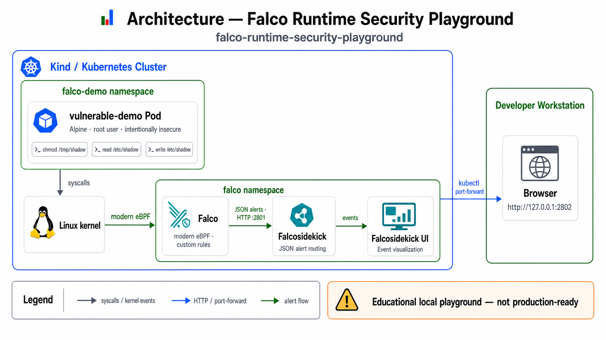
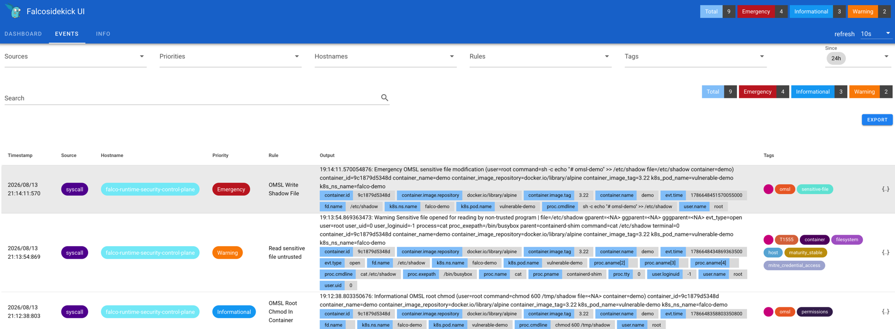

<p align="center">
  
</p>

<h1 align="center">Falco Runtime Security Playground</h1>
 
<p align="center">

A reproducible Kubernetes proof of concept for detecting suspicious container activity at runtime with Falco, modern eBPF, Falcosidekick, and Falcosidekick UI.

The playground deploys an intentionally vulnerable container and exactly three custom Falco rules. Each scenario generates a different severity so that the complete flow from Linux syscall to visual alert can be explored locally.

This repository is an educational playground. It is not a production-ready runtime security platform, and the vulnerable workload must only be used in a disposable local lab.

</p>

<p align="center">

[](LICENSE)
[](https://kubernetes.io/)
[](https://falco.org/)
[](https://falco.org/docs/concepts/event-sources/kernel/)

</p>

## 📋 Overview

The project demonstrates three runtime detections inside a Kubernetes container:

1. **Permission change**: root changes file permissions with `chmod`.
2. **Sensitive file read**: a process opens `/etc/shadow` for reading.
3. **Sensitive file modification**: a process opens `/etc/shadow` for writing.

Falco observes the corresponding Linux syscalls and evaluates the custom rules. JSON alerts are forwarded by Falcosidekick and displayed in Falcosidekick UI.

## 🏗️ Architecture



Kind runs the local Kubernetes cluster. Falco is installed through its official Helm chart as a node-level runtime sensor.

## 🧩 Components

| Component | Purpose |
|---|---|
| Kind | Runs the disposable local Kubernetes cluster |
| `vulnerable-demo` | Generates controlled suspicious activity inside a container |
| Falco | Captures syscalls and evaluates runtime security rules |
| Modern eBPF driver | Connects Falco to kernel events without loading a custom kernel module |
| Falcosidekick | Receives and routes Falco JSON alerts |
| Falcosidekick UI | Displays the generated events and their severities |
| Helm | Installs and configures the Falco stack |

## 🎯 Objective

Demonstrate a small, reproducible runtime security workflow in which container activity is detected at syscall level, classified by custom Falco rules, forwarded to an alert router, and inspected through a local web interface.

## 🚨 Detection Scenarios

The lab deliberately defines exactly three custom rules:

| Scenario | Rule | Priority |
|---|---|---|
| root changes permissions | `OMSL Root Chmod In Container` | `INFORMATIONAL` |
| process reads `/etc/shadow` | `OMSL Read Shadow File` | `CRITICAL` |
| process writes `/etc/shadow` | `OMSL Write Shadow File` | `EMERGENCY` |

Falco priorities follow syslog-style severity levels. The priorities used here make the visual differences obvious in the UI; they are pedagogical choices, not a universal incident-response policy.

## 🛠️ Prerequisites

- Docker
- Kind
- kubectl
- Helm
- A Linux host, or a macOS container runtime capable of exposing the required Linux kernel features

## 📥 Installation

Clone the repository and enter its directory:

```bash
git clone https://github.com/openmind-systems-lab/falco-runtime-security-playground.git
cd falco-runtime-security-playground
```

## 🚀 Quick Start

Create the Kind cluster, install Falco and Falcosidekick, and deploy the demonstration Pod:

```bash
make deploy
```

The deployment creates:

- Kind cluster `falco-runtime-security`;
- namespace `falco` for the runtime security stack;
- Falco configured with the modern eBPF driver;
- Falcosidekick, Falcosidekick UI, and ephemeral Redis storage;
- namespace `falco-demo` with the intentionally vulnerable `vulnerable-demo` Pod.

Check the resources:

```bash
make status
```

In another terminal, expose the UI locally:

```bash
make ui
```

Open `http://127.0.0.1:2802` in a browser.

## ✅ Verification

Run all three detection scenarios sequentially:

```bash
make demo
```

Refresh Falcosidekick UI and confirm that the following alerts are present:

- `OMSL Root Chmod In Container` with priority `INFORMATIONAL`;
- `OMSL Read Shadow File` with priority `CRITICAL`;
- `OMSL Write Shadow File` with priority `EMERGENCY`.



To inspect raw Falco output instead, run:

```bash
make logs
```

## 🧪 Running Individual Detections

### INFORMATIONAL — permission change

```bash
make test-informational
```

The test executes:

```bash
kubectl -n falco-demo exec vulnerable-demo -- chmod 600 /tmp/shadow
```

### CRITICAL — sensitive file read

```bash
make test-critical
```

The test executes:

```bash
kubectl -n falco-demo exec vulnerable-demo -- cat /etc/shadow
```

### EMERGENCY — sensitive file modification

```bash
make test-emergency
```

The test executes:

```bash
kubectl -n falco-demo exec vulnerable-demo -- sh -c 'echo "# omsl-demo" >> /etc/shadow'
```

The emergency test changes `/etc/shadow` only inside the disposable demonstration container.

## 🧠 Rule Design

The readable rule source is stored in `falco/custom-rules.yaml`. The same three rules are embedded in `falco/values.yaml`, where the official Helm chart loads them through `customRules`.

Each rule restricts detection to containers with `container.id != host`:

- the permission rule matches an inbound `chmod` syscall executed by UID `0`;
- the read rule matches `open`, `openat`, or `openat2` on `/etc/shadow` when opened for reading;
- the write rule matches the same open syscalls when `/etc/shadow` is opened for writing.

Alert output includes the user, process command line, file path, and container name to provide useful investigation context.

## 🍎 macOS and Kind Caveat

Falco observes a Linux kernel. On macOS, Kind itself runs inside the Linux VM provided by the container runtime, and successful syscall capture depends on the kernel features exposed by that VM.

Falco's learning-environment documentation does not guarantee direct Kind support on macOS or LinuxKit. If the modern eBPF driver cannot initialize, run this repository inside a Linux VM. The Falco rules and Kubernetes workload remain unchanged.

## 🔐 Security and Production Limitations

The `vulnerable-demo` Pod intentionally runs as root and replaces `/etc/passwd` and `/etc/shadow` inside its own container. It exists only to produce deterministic security events.

This PoC does not include rule tuning for a real workload, event retention, authentication, TLS, high availability, external alert destinations, SIEM integration, or an incident-response workflow.

For a real environment:

- derive priorities and response actions from the organization's threat model;
- tune rules against normal workload behavior and measure false positives;
- protect access to Falcosidekick UI and all alert destinations;
- persist or export events according to retention requirements;
- integrate alerts with an owned triage and escalation process;
- pin and regularly update chart and container versions;
- validate kernel and eBPF compatibility on every supported node image.

## 🎓 What You Will Learn

- how Falco observes container behavior through Linux syscalls;
- how the modern eBPF driver connects Falco to kernel events;
- how to write and load custom Falco rules with Helm;
- how rule conditions distinguish reads, writes, and permission changes;
- how Falcosidekick routes alerts to a visual interface;
- why severity classification and rule tuning are environment-specific.

## 🧹 Cleanup

Delete the Kind cluster and every resource created by the playground:

```bash
make cleanup
```

## 📚 References

- [Falco documentation](https://falco.org/docs/)
- [Falco rules](https://falco.org/docs/concepts/rules/)
- [Falco kernel event sources](https://falco.org/docs/concepts/event-sources/kernel/)
- [Deploying Falco on Kubernetes](https://falco.org/docs/setup/kubernetes/)
- [Falco Helm charts](https://github.com/falcosecurity/charts)
- [Falcosidekick](https://github.com/falcosecurity/falcosidekick)
- [Falcosidekick UI](https://github.com/falcosecurity/falcosidekick-ui)
- [Kind documentation](https://kind.sigs.k8s.io/)
- [Kubernetes documentation](https://kubernetes.io/docs/)

## 🏛 About OpenMind Systems Lab

OpenMind Systems Lab is an independent French non-profit association dedicated to research, experimental development and technical benchmarking in Cloud Native technologies.

Our mission is to produce practical, reproducible and educational Open Source Proofs of Concept covering Kubernetes, Platform Engineering, Distributed Messaging, Infrastructure Security and Artificial Intelligence.

GitHub Organization:

https://github.com/openmind-systems-lab

---

<p align="center">
Made with ❤️ by OpenMind Systems Lab
</p>
